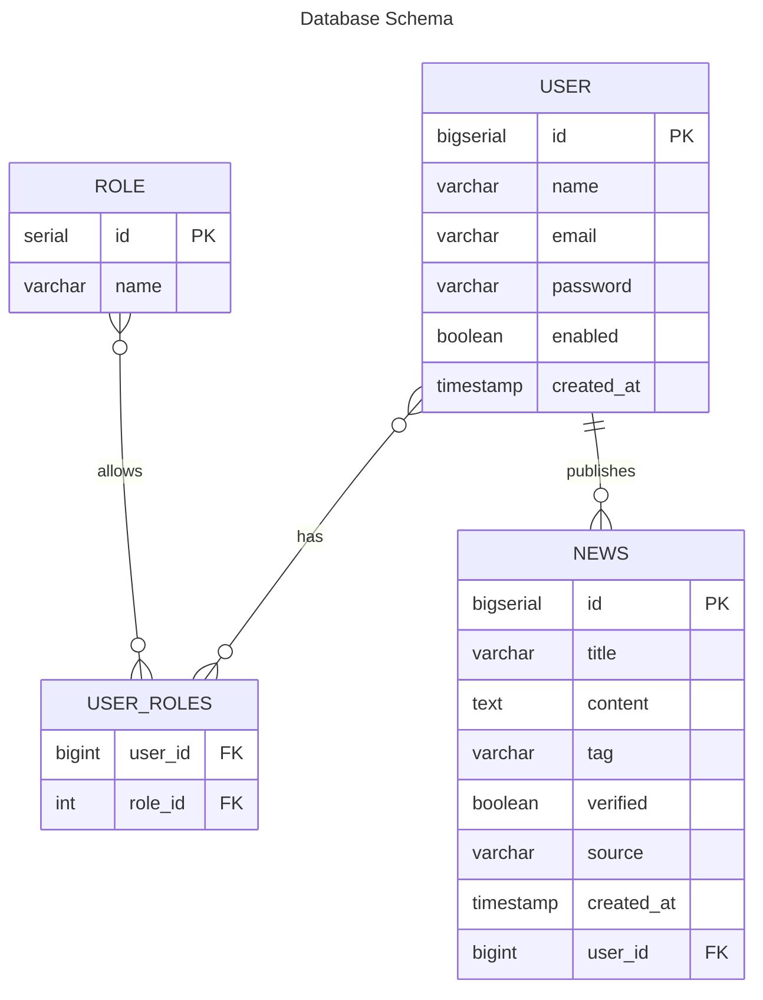

# News

## Resumo
Aplicação em que usuários podem cadastrar notícias, receber notificação de novas notícias por email.

## Tecnologias e ferramentas

## Diagramas

### Diagrama entidade relacionamento

